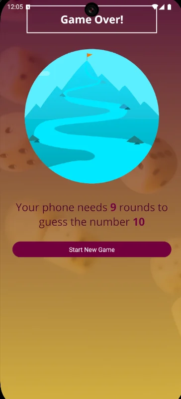

# 🎮 Number Guessing Game

A fun and interactive React Native mobile game where you pick a number and challenge the computer to guess it! Built with Expo and featuring a beautiful gradient UI with responsive design.

## 📱 Screenshots




## 🎯 Game Rules

1. **Choose a Number**: Pick any number between 1 and 99
2. **Computer Guesses**: The computer will make intelligent guesses to find your number
3. **Give Feedback**: Tell the computer if your number is higher or lower than its guess
4. **Win Condition**: The game ends when the computer correctly guesses your number
5. **Score**: See how many rounds it took the computer to guess your number

## ✨ Features

### 🎮 Gameplay
- **Smart AI**: Computer uses binary search algorithm for efficient guessing
- **Cheat Detection**: Prevents users from giving false feedback
- **Round Tracking**: Keep track of all computer guesses with round numbers
- **Guess History**: View all previous guesses in a scrollable list

### 🎨 User Interface
- **Modern Design**: Beautiful gradient backgrounds with custom colors
- **Responsive Layout**: Adapts to different screen sizes (phones and tablets)
- **Custom Fonts**: Clean typography using Open Sans font family
- **Platform-Specific Styling**: Different designs for iOS and Android
- **Smooth Animations**: Button press effects and transitions

### 📱 Cross-Platform
- **iOS Support**: Optimized for iPhone and iPad
- **Android Support**: Material Design elements and ripple effects
- **Expo Go Compatible**: Run instantly with Expo Go app
- **Native Build Ready**: Can be built as standalone native apps

## 🛠️ Technology Stack

### **Core Technologies**
- **React Native**: Cross-platform mobile development
- **Expo**: Development platform and build tools
- **JavaScript**: Primary programming language

### **UI Components**
- **React Native Components**: View, Text, Pressable, FlatList, etc.
- **Expo Vector Icons**: Beautiful icons (Ionicons)
- **Linear Gradient**: Background gradients
- **Custom Fonts**: Open Sans family

### **Development Tools**
- **Expo CLI**: Development and build tool
- **Metro Bundler**: JavaScript bundler
- **Hot Reloading**: Instant code updates during development

## 📦 Installation

### Prerequisites
- **Node.js** (v14 or higher)
- **npm** or **yarn**
- **Expo CLI** (install globally: `npm install -g expo-cli`)
- **Mobile Device** with Expo Go app OR **Emulator**

### Setup Instructions

1. **Clone the repository**
   ```bash
   git clone <repository-url>
   cd GuessingNubmerGame
   ```

2. **Install dependencies**
   ```bash
   npm install
   # or
   yarn install
   ```

3. **Start the development server**
   ```bash
   npm start
   # or
   expo start
   ```

4. **Run on device/emulator**
   - **Physical Device**: Scan QR code with Expo Go app
   - **iOS Simulator**: Press `i` in terminal
   - **Android Emulator**: Press `a` in terminal
   - **Web Browser**: Press `w` in terminal

## 🎮 How to Play

### 1. Start Screen
- Enter a number between 1 and 99 in the input field
- Tap **"Confirm"** to start the game
- Use **"Reset"** to clear your input

### 2. Game Screen
- The computer will make its first guess
- Choose your feedback:
  - **➖ (Lower)**: Your number is lower than the computer's guess
  - **➕ (Higher)**: Your number is higher than the computer's guess
- Watch the guess history build up as the game progresses

### 3. Game Over Screen
- Celebrate! The computer found your number
- See how many rounds it took
- Tap **"Start New Game"** to play again

## 🏗️ Project Structure

```
GuessingNubmerGame/
├── App.js                     # Main application component
├── index.js                   # Entry point
├── app.json                   # Expo configuration
├── package.json               # Dependencies and scripts
├── assets/                    # Images and fonts
│   ├── fonts/
│   │   ├── OpenSans-Bold.ttf
│   │   └── OpenSans-Regular.ttf
│   └── images/
│       ├── background.png
│       └── success.png
├── components/                # Reusable components
│   ├── game/
│   │   ├── GuessLogItem.js   # Individual guess history item
│   │   └── NumberContainer.js # Prominent number display
│   └── ui/
│       ├── Card.js           # Card container component
│       ├── InstructionText.js # Styled instruction text
│       ├── PrimaryButton.js  # Main button component
│       └── Title.js          # Title component
├── constants/
│   └── colors.js             # App color palette
└── screens/                  # Main app screens
    ├── GameOverScreen.js     # Results and restart screen
    ├── GameScreen.js         # Main gameplay screen
    └── StartGameScreen.js    # Number input screen
```

## 🎨 Design System

### Color Palette
```javascript
{
  primary500: "#72063c",    // Main brand color (magenta)
  primary600: "#640233",    // Pressed button state
  primary700: "#4e0329",    // Dark gradient
  primary800: "#4e0329",    // Borders and emphasis
  accent500: "#ddb52f",     // Golden yellow highlights
}
```

### Typography
- **Primary Font**: Open Sans Regular
- **Bold Font**: Open Sans Bold
- **Title Size**: 24px
- **Body Size**: 18-24px
- **Number Display**: 36px

### Responsive Breakpoints
- **Small devices**: < 380px width
- **Large devices**: > 500px width
- **Compact height**: < 400px height

## 🧩 Component Architecture

### **App.js** - Main Controller
- Manages global game state
- Handles screen navigation
- Loads fonts and assets

### **Screen Components**
- **StartGameScreen**: Number input and validation
- **GameScreen**: Gameplay logic and guess history
- **GameOverScreen**: Results display and restart

### **UI Components**
- **PrimaryButton**: Reusable button with press effects
- **Card**: Container with shadows and rounded corners
- **Title**: Styled headers with platform differences
- **InstructionText**: Accent-colored instruction text

### **Game Components**
- **NumberContainer**: Prominent number display with borders
- **GuessLogItem**: Individual entries in guess history

## 🔧 Configuration

### Expo Configuration (`app.json`)
```json
{
  "expo": {
    "name": "Number Guessing Game",
    "slug": "number-guessing-game",
    "version": "1.0.0",
    "orientation": "portrait",
    "platforms": ["ios", "android", "web"]
  }
}
```

### Font Loading
Custom fonts are loaded using `expo-font`:
```javascript
const [fontLoaded] = useFonts({
  'open-sans': require('./assets/fonts/OpenSans-Regular.ttf'),
  'open-sans-bold': require('./assets/fonts/OpenSans-Bold.ttf'),
});
```

## 🧪 Algorithm Details

### Binary Search Guessing Strategy
The computer uses an intelligent binary search algorithm:

1. **Initial Range**: 1 to 100
2. **First Guess**: Random number excluding user's number
3. **Feedback Processing**:
   - If "lower": Set max boundary to current guess
   - If "higher": Set min boundary to current guess + 1
4. **Next Guess**: Random number within updated boundaries
5. **Repeat**: Until correct guess is found

### Cheat Detection
The app validates user feedback to prevent cheating:
```javascript
if (
  (direction === "lower" && currentGuess < userNumber) ||
  (direction === "greater" && currentGuess > userNumber)
) {
  // Show "Don't lie!" alert
}
```

## 📱 Platform Differences

### iOS
- Opacity-based button press effects
- No title borders
- iOS-specific shadow properties

### Android
- Material Design ripple effects
- Title borders for emphasis
- Elevation for shadows

## 🚀 Building for Production

### Development Build
```bash
expo build:android
expo build:ios
```

### Standalone Apps
```bash
# Android APK
expo build:android -t apk

# iOS App Store
expo build:ios -t archive
```

### Expo Application Services (EAS)
```bash
# Install EAS CLI
npm install -g eas-cli

# Configure project
eas build:configure

# Build for production
eas build --platform all
```

## 🐛 Common Issues & Solutions

### Font Loading Issues
- Ensure font files are in `assets/fonts/`
- Check font names match exactly in `useFonts()`
- Wait for `fontLoaded` before rendering

### Layout Problems
- Use `useWindowDimensions()` for responsive design
- Test on different screen sizes
- Check SafeAreaView implementation

### State Management Issues
- Ensure state updates are properly handled
- Use functional updates for complex state changes
- Reset boundary variables between games

## 🤝 Contributing

1. Fork the repository
2. Create a feature branch (`git checkout -b feature/amazing-feature`)
3. Commit your changes (`git commit -m 'Add amazing feature'`)
4. Push to the branch (`git push origin feature/amazing-feature`)
5. Open a Pull Request

### Development Guidelines
- Follow JSDoc documentation standards
- Use consistent naming conventions
- Test on both iOS and Android
- Maintain responsive design principles

## 📄 License

This project is licensed under the MIT License - see the [LICENSE](LICENSE) file for details.

## 🙏 Acknowledgments
- **Expo Team** for the amazing development platform
- **React Native Community** for excellent documentation
- **Google Fonts** for Open Sans font family
- **Ionicons** for beautiful icons

## 📞 Support
If you encounter any issues or have questions:

1. Check the [Common Issues](#-common-issues--solutions) section
2. Search existing [Issues](link-to-issues)
3. Create a new issue with detailed description
4. Join our community discussions

---

**Built with ❤️ using React Native and Expo**

*Happy Gaming! 🎮*
